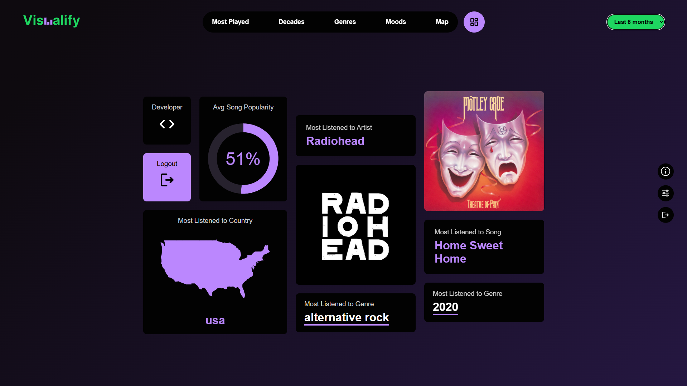
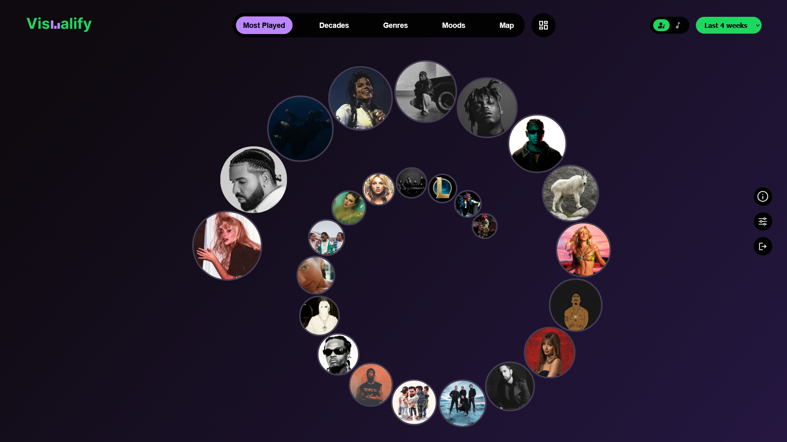
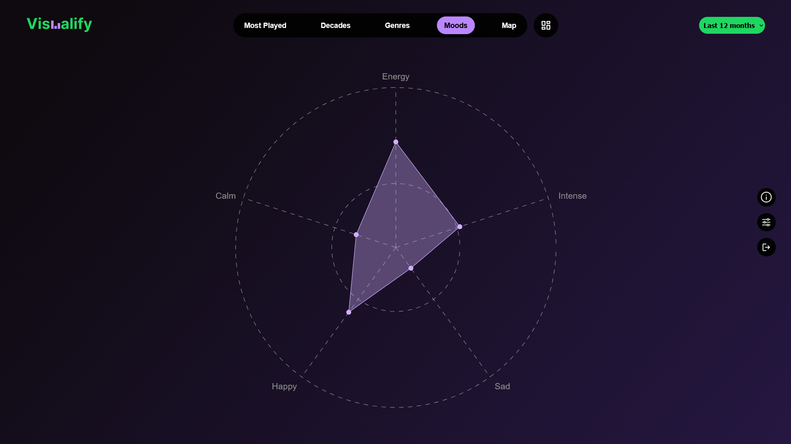
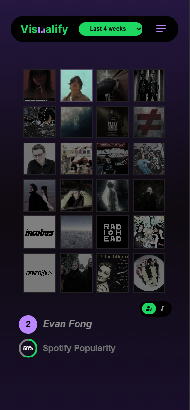

# Visualify


Visualify 2.0 is a Spotify analytics and music visualization web application built with Deno, TypeScript, and vanilla JavaScript. The app connects to the Spotify Web API to display personalized listening insights, including top tracks, top artists, genres, decades, moods, and geographic listening trends.

## Features

<!-- Features Preview Images -->

<!-- Add screenshots/gifs of analytics pages here -->

| Dashboard                                  | Artist Analytics                       | Mood Analysis                    |
| ------------------------------------------ | -------------------------------------- | -------------------------------- |
|  |  |  |

* Spotify OAuth authentication
* Top artists and tracks analysis
* Short-term, medium-term, and long-term listening statistics
* Mood and audio feature analysis
* Artist country and geographic data visualization
* Decade and genre insights
* Responsive desktop and mobile layouts
* Demo mode support
* Cached server-side data storage

## Tech Stack

### Frontend

* Vanilla JavaScript
* HTML5
* CSS3

### Backend

* Deno
* TypeScript
* REST API architecture

### External APIs

* Spotify Web API
* MusicBrainz API
* Wikidata API

### Database

* SQL-based storage layer

---

# Project Structure

```txt
visualify.2.0/
├── api/                 # API route handlers and utilities
├── db/                  # Database queries, schema, and helpers
├── public/              # Frontend application
│   ├── components/      # Reusable UI components
│   ├── logic/           # Frontend business logic
│   ├── media/           # Static assets
│   ├── pages/           # Application pages
│   └── apiCom/          # Frontend API communication layer
├── server/              # Deno server setup
├── deno.json            # Deno configuration
└── auth.env             # Environment variables
```

---

# Getting Started

## Prerequisites

Make sure you have the following installed:

* Deno
* Git
* Spotify Developer account

Install Deno:

```bash
curl -fsSL https://deno.land/install.sh | sh
```

---

# Spotify Setup

1. Go to the Spotify Developer Dashboard.
2. Create a new application.
3. Add the following redirect URI:

```txt
http://127.0.0.1:8888/
```

4. Copy your Spotify Client ID.

---

# Environment Configuration

Create or update the `auth.env` file:

```env
SPOTIFY_CLIENT_ID=your_client_id
```

---

# Running the Project

## Start the Development Server

```bash
deno run --allow-net --allow-read --allow-env --watch server/server.ts
```

The app will be available at:

```txt
http://127.0.0.1:8888
```

---

# API Endpoints

## Authentication

| Method | Endpoint                | Description                           |
| ------ | ----------------------- | ------------------------------------- |
| POST   | `/api/set-token`        | Exchanges Spotify auth code for token |
| GET    | `/api/check-token-auth` | Validates user authentication         |
| POST   | `/api/logout`           | Logs out the current user             |

## Spotify Data

| Method | Endpoint              | Description                      |
| ------ | --------------------- | -------------------------------- |
| GET    | `/api/top-items`      | Fetches top artists or tracks    |
| GET    | `/api/latest-songs`   | Retrieves recently played songs  |
| POST   | `/api/songs-features` | Retrieves Spotify audio features |

## Internal Data

| Method | Endpoint                | Description                        |
| ------ | ----------------------- | ---------------------------------- |
| POST   | `/api/set-server-data`  | Stores user data                   |
| GET    | `/api/get-demo-data`    | Returns demo data                  |
| POST   | `/api/get-country-data` | Fetches cached artist country data |
| POST   | `/api/set-country-data` | Stores artist country data         |
| POST   | `/api/get-mood-data`    | Retrieves song mood data           |
| POST   | `/api/set-mood-data`    | Stores mood analysis data          |

---

# Application Flow

1. User logs in with Spotify.
2. Spotify OAuth flow authenticates the user.
3. The frontend requests listening data through the backend API.
4. The backend communicates with Spotify and external metadata services.
5. Data is formatted, cached, and rendered into visual insights.

---

# Responsive Design

<!-- Responsive Layout Showcase -->

<!-- Add desktop/mobile comparison screenshots here -->

| Desktop View                                | Mobile View                               |
| ------------------------------------------- | ----------------------------------------- |
|  |  |

Visualify automatically switches between desktop and phone layouts based on screen width.

* Desktop layout
* Mobile layout
* Adaptive navigation and rendering

---

# Demo Mode

The application includes a demo mode that loads pre-stored listening data without requiring Spotify authentication.

---

# Future Improvements

* Playlist analytics
* Listening timeline visualizations
* Advanced charting
* User profile customization
* Better caching and rate limiting
* Expanded audio feature comparisons

---

# Security Notes

* Spotify authentication uses OAuth.
* Tokens are validated server-side.
* Sensitive credentials should never be committed to source control.

---

# License

This project is intended for educational and personal portfolio use.

---

# Author

Developed as part of the Visualify project.
